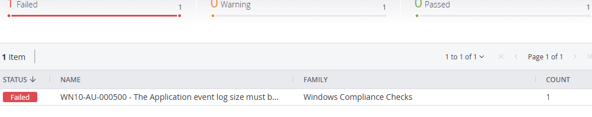
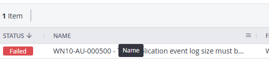
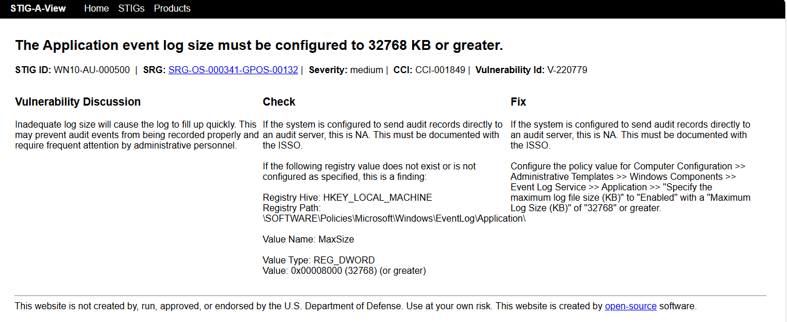
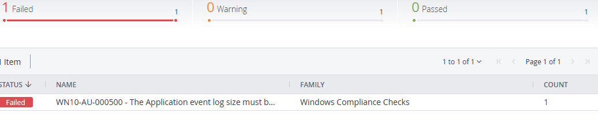
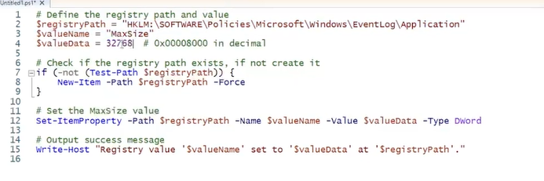
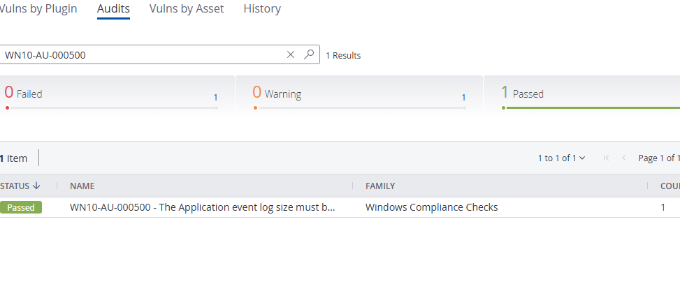
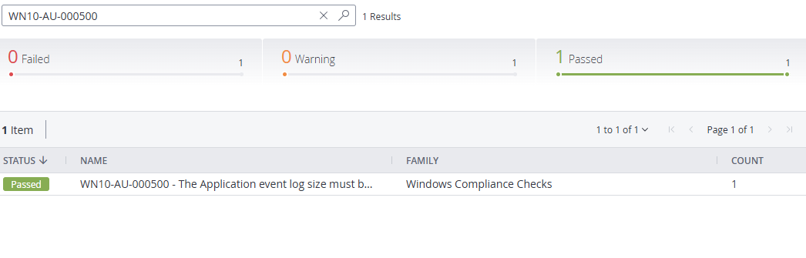

<h1 align="center">🛡️ Windows 10 STIG Remediation – WN10-AU-000500</h1>

  📌 Real-world lab fixing a DISA STIG finding on a Windows 10 system using Tenable.io, manual registry edits, and PowerShell automation.
   
  <strong>🔁 Scan ➜ Fix ➜ Undo ➜ Automate ➜ Verify</strong>

  
  
  
  

---

## 📋 Overview

This lab demonstrates how I remediated a real STIG finding (`WN10-AU-000500`) on a Windows 10 virtual machine using:

- 📍 Tenable.io scans
- 🛠️ Manual registry edits
- ⚙️ PowerShell scripting
- 🔁 Before/after verification scans

---

## 🔍 Step 1: Scan Your Windows 10 VM

I launched a **Windows 10 STIG Audit Policy Scan** using Tenable.io.  
The scan flagged this finding:

> **STIG ID:** `WN10-AU-000500`  
> **Issue:** The Application event log size must be set to 32768 KB or greater.

📸 **Scan Result: STIG Failed**

---

## 📌 Step 2: Pick a STIG to Remediate

I selected `WN10-AU-000500` for this lab because:
- It's registry-based ✅
- It’s relevant to audit log integrity ✅
- Easy to test, revert, and automate ✅

📸 **Reference Screenshot from STIG Documentation**

---

## 🛠️ Step 3: Fix the STIG Manually

I used `regedit` to:
- Navigate to:  
  `HKEY_LOCAL_MACHINE\SOFTWARE\Policies\Microsoft\Windows\EventLog\Application`
- Create or update:  
  `MaxSize` as `REG_DWORD` = `32768`

📸 **Manual Fix Passed**

---

## 🔁 Step 4: Undo Manual Fix and Rescan

To prove the fix worked, I deleted the registry entry and rescanned.

📸 **Scan Result: Failure Returns**

---

## ⚙️ Step 5: Implement Fix Using PowerShell + ChatGPT

I worked with ChatGPT to build a PowerShell script that:
- Creates the registry key if it doesn’t exist
- Sets `MaxSize = 32768` automatically

📸 **PowerShell Script Screenshot**

📄 See the full script here:  
[`scripts/WN10-AU-000500_Remediation.ps1`](./scripts/WN10-AU-000500_Remediation.ps1)

---

## 🔄 Step 6: Run Final Scan to Confirm Fix

After applying the PowerShell script, I ran another scan to verify remediation.

📸 **PowerShell Fix Passed**

📸 **Final Compliance Summary**

---

## ✅ What I Learned

- How to interpret and remediate STIG findings
- How to manually edit and test registry values
- How to automate fixes with PowerShell
- How to prove compliance using before/after scans

---

## 🎥 Follow My Cybersecurity Journey

  🛻 From Truck Driver ➜ 💻 To Cybersecurity Professional  
    
  🎯 I document real labs just like this  
  🎥 <strong>@truck2tech</strong> on TikTok

